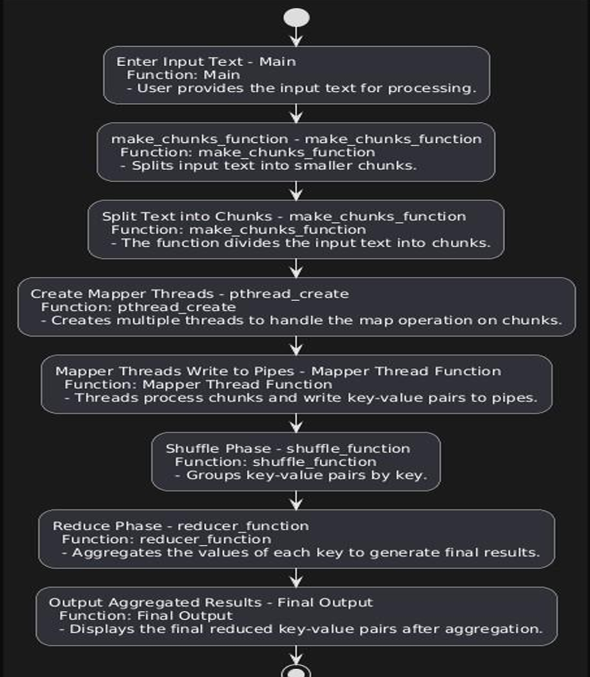
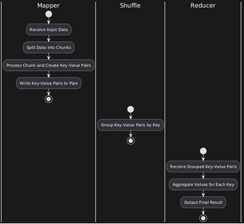
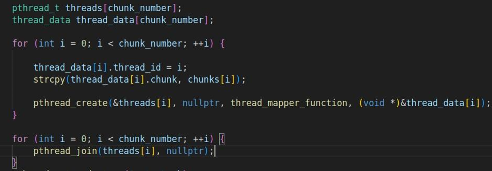
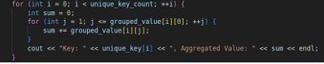

⚙️ MapReduce Framework Implementation in C++

[](https://en.cppreference.com/)
[]()
[](LICENSE)

A lightweight simulation of the MapReduce framework using C++, multithreading, and named pipes.
Designed to replicate distributed data processing on a single machine using pthreads and inter-process communication.

---

## 📚 Table of Contents

- [🧠 Introduction](#-introduction)
- [🛠️ Design & Architecture](#️-design--architecture)
- [🔁 Flow Diagrams](#flow-diagrams)
- [💻 Code Overview](#-code-overview)
- [📈 Sample Output](#-sample-output)
- [✅ Conclusion](#-conclusion)
- [▶️ How to Run](#-how-to-run)

---

## 🧠 Introduction

This project demonstrates a mini MapReduce system using:
- 🧵 POSIX threads for parallel mapping
- 🧪 Named pipes for communication
- 🔄 Shuffle and reduce logic for aggregation

Mimics how distributed systems process large text datasets using:
- **Map Phase** – Emit key-value pairs
- **Shuffle Phase** – Group data by key
- **Reduce Phase** – Aggregate final results

---

## 🛠️ Design & Architecture

### 🧩 Map Phase
- Input text is split into N chunks
- Each thread reads a chunk and emits (`word`, `1`)
- Key-value pairs are written to uniquely named pipes

### 🔄 Shuffle Phase
- Reducer reads all pipe data
- Groups values by identical keys

### 📉 Reduce Phase
- Aggregates values for each key
- Produces final count (word frequency)

---

## 🔁 Flow Diagrams

### 🔷 System Flow


### 🔶 Mapper–Reducer Activity


---

## 💻 Code Overview

### 🔹 Mapper Code
- `make_chunks_function()` – Splits input into equal chunks
- `thread_mapper_function()` – Each thread emits (`word`, `1`)
- Uses `pthread_mutex` for synchronization

### 🔹 Reducer Code
- `pipe_read()` – Reads named pipes
- `shuffle_function()` – Groups key-value pairs
- `reducer_function()` – Sums values per key




---

## 📈 Sample Output

### 🔸 Input
```
red blue green yellow red green blue yellow blue green
```

### 🔸 Chunk Split (N = 4)
```
Chunk 0: red blue green
Chunk 1: yellow red green
Chunk 2: blue yellow
Chunk 3: blue green
```

### 🔸 Mapper Output (to pipes)
```
pipe_0 → red 1, blue 1, green 1
pipe_1 → yellow 1, red 1, green 1
pipe_2 → blue 1, yellow 1
pipe_3 → blue 1, green 1
```

### 🔸 Reducer Output
```
--- Shuffle Phase ---
Key: red → [1, 1]
Key: blue → [1, 1, 1]
Key: green → [1, 1, 1]
Key: yellow → [1, 1]

--- Reduce Phase ---
Key: red → 2
Key: blue → 3
Key: green → 3
Key: yellow → 2
```

---

## ✅ Conclusion

✅ Successfully simulated MapReduce locally  
✅ Threaded input splitting + named pipe communication  
✅ Accurate aggregation using reducer logic  

---

## ▶️ How to Run

1️⃣ Compile the mapper and reducer:
```bash
g++ -o mapper mapper.cpp -lpthread
g++ -o reducer reducer.cpp
```

2️⃣ Run the mapper:
```bash
./mapper
```

3️⃣ Then run the reducer:
```bash
./reducer
```

Pipes and thread count can be configured inside the source files.

---

## 👤 Author

**Saim Nadeem**  
🔗 GitHub: [Saim-Nadeem](https://github.com/Saim-Nadeem)
