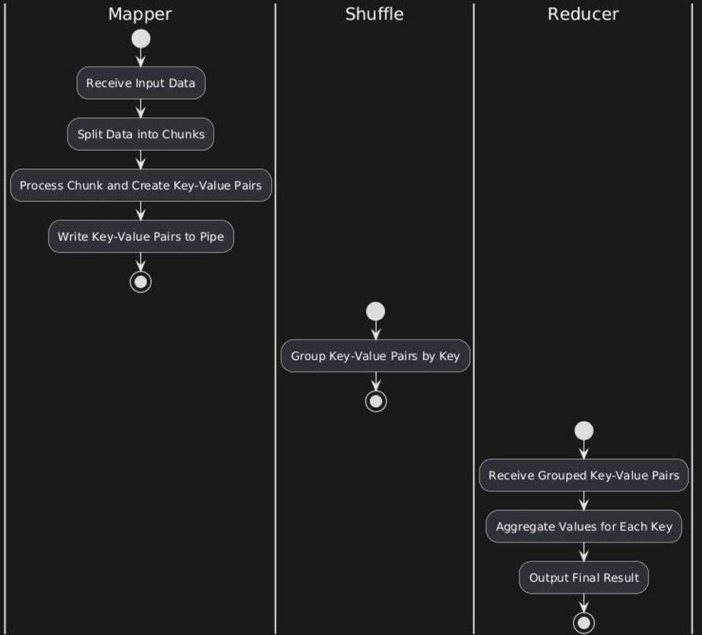

# MapReduce Framework Implementation in C++

## Table of Contents
- [Introduction](#introduction)
- [Approach and Design](#approach-and-design)
  - [Map Phase](#map-phase)
  - [Shuffle Phase](#shuffle-phase)
  - [Reduce Phase](#reduce-phase)
- [Flow/Activity Diagram](#flowactivity-diagram)
- [Code Explanation](#code-explanation)
  - [Mapper Code](#mapper-code)
  - [Reducer Code](#reducer-code)
- [Results](#results)
- [Conclusion](#conclusion)
- [Future Scope](#future-scope)
- [How to Run](#how-to-run)

---

## Introduction

The MapReduce framework is a programming paradigm designed to handle large-scale data processing by breaking it into smaller, parallelizable tasks. This project implements a basic MapReduce framework in C++ on a single machine, simulating distributed data processing using threads and inter-process communication.

The framework consists of three main phases:

- **Map Phase:** Divides and processes input data into key-value pairs.
- **Shuffle Phase:** Groups data by keys.
- **Reduce Phase:** Aggregates the results to produce the final output.

This repository includes the approach, code implementation, and results.

---

## Approach and Design

### Map Phase
1. Input text is divided into smaller chunks.
2. Threads are created for parallel processing of chunks. Each thread:
   - Processes its chunk to extract individual words.
   - Emits key-value pairs in the form (`"word"`, `1`).
3. Key-value pairs are written to named pipes for inter-process communication.

### Shuffle Phase
1. The Reducer reads key-value pairs from named pipes.
2. All occurrences of a particular key are combined into a list (e.g., `("blue", [1, 1, 1])`).
3. The system ensures that the data is grouped correctly before the Reduce phase.

### Reduce Phase
1. The Reducer processes grouped key-value pairs to aggregate values.
2. For each key, all associated values are summed up to produce the final count.
3. Results are displayed, representing the frequency of each word in the input text.

---

## Flow/Activity Diagram

### High-Level Flow Diagram

### Activity Diagram for Mapper and Reducer Interaction

---

## Code Explanation

### Mapper Code
The Mapper is responsible for processing the input data and generating key-value pairs.

#### 1. `make_chunks_function`
Divides input text into smaller chunks based on the number of threads.

**Input:**
- `text`: The input string.
- `chunk_number`: The number of chunks to divide the text into.

**Output:**
- An array of strings, each representing a chunk.

**Logic:**
1. Split the text into words.
2. Distribute words evenly across the specified number of chunks.

#### 2. `thread_mapper_function`
Each thread:
- Reads its chunk word by word.
- Emits key-value pairs in the form (`"word"`, `1`).
- Writes these pairs to a named pipe.

**Synchronization:**  
- Uses `pthread_mutex` to prevent race conditions during output operations.

#### 3. Thread Management
- Threads are created using `pthread_create`.
- After processing, `pthread_join` ensures all threads complete execution.

### Reducer Code
The Reducer reads data from named pipes, groups it by key, and aggregates the results.

#### 1. `pipe_read`
Reads key-value pairs from named pipes.

**Input:** Pipe name  
**Output:** Parsed key-value pairs  

#### 2. `shuffle_function`
Groups key-value pairs by key.

**Logic:**
1. For each key, check if it exists in the unique keys list.
2. If found, append the value to the existing group; otherwise, create a new group.

#### 3. `reducer_function`
Aggregates values for each unique key.

**Output:** The sum of values for each key.

---

## Results
### Example Input:
red blue green yellow red green blue yellow blue green

**Number of Chunks: 4**

### Example Mapper Output:
 
Enter the input text: red blue green yellow red green blue  
yellow blue green  
Enter the number of chunks: 4  
Chunk 0: [red blue green]  
Chunk 1: [yellow red green]  
Chunk 2: [blue yellow]  
Chunk 3: [blue green]  
Mapper processing chunk: red blue green  
Mapper processing chunk: yellow red green  
Mapper processing chunk: blue yellow  
Mapper processing chunk: blue green  
Writing to pipe pipe_0: red 1  
Writing to pipe pipe_0: blue 1  
Writing to pipe pipe_0: green 1  
Writing to pipe pipe_1: yellow 1  
Writing to pipe pipe_1: red 1  
Writing to pipe pipe_1: green 1  
Writing to pipe pipe_2: blue 1  
Writing to pipe pipe_2: yellow 1   
Writing to pipe pipe_3: blue 1  
Writing to pipe pipe_3: green 1  

### Example Reducer Output:
--- Reading from Pipes ---  
--- Shuffle Phase Results ---  
  Key: red, Value: 1 1  
  Key: blue, Value: 1 1 1  
  Key: green, Value: 1 1 1  
  Key: yellow, Value: 1 1  
 --- Reduce Phase --Key: red,  
  Aggregated Value: 2  
  Key: blue, Aggregated Value: 3  
  Key: green, Aggregated Value: 3  
  Key: yellow, Aggregated Value: 2  

## Conclusion
This project successfully implements a basic MapReduce framework in C++ for single-machine execution. The results demonstrate:
- Efficient splitting of input data into chunks.
- Proper synchronization and inter-process communication.
- Accurate aggregation of results.

---

## Future Scope
1. Extend the implementation to a distributed system with multiple nodes.
2. Optimize for handling larger datasets using advanced data structures.
3. Incorporate fault tolerance for thread and process failures.

---

## How to Run
1. Compile the Mapper and Reducer programs.
2. Run the Mapper and provide input text.
3. Run the Reducer to process key-value pairs.

